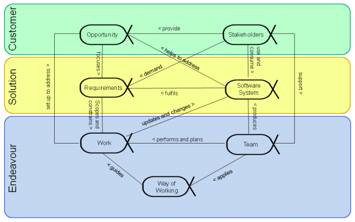
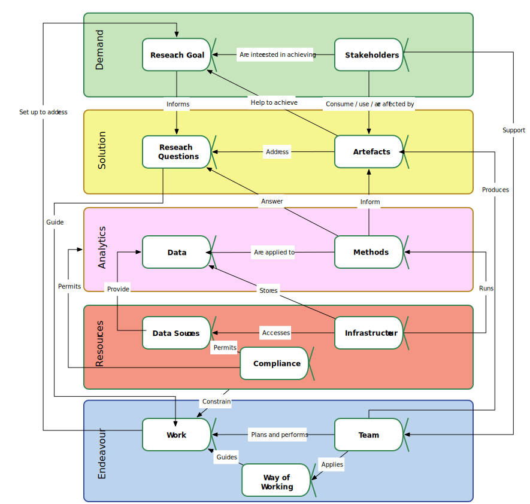
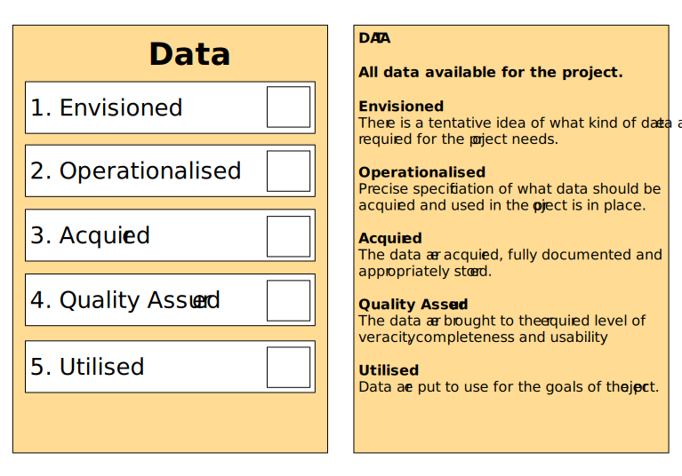
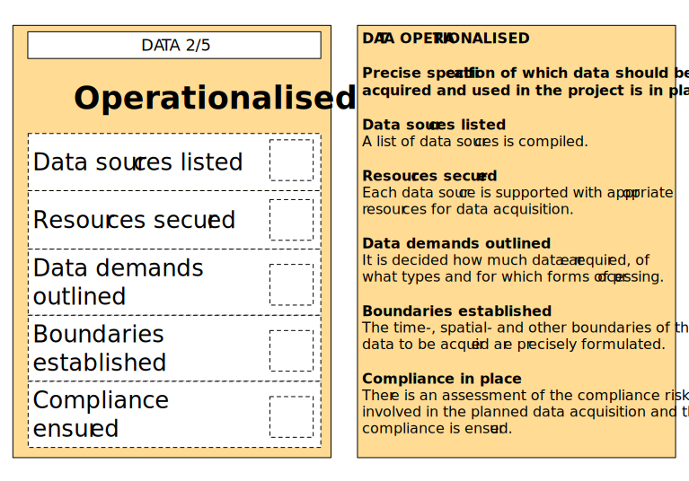

# Social Data Science Scorecard Deck

*The Social Data Science Scorecard Deck is an agile project management tool addressing core
individual aspects of a social data science project.*

The Deck helps social data science teams to:

* Ensure balanced development of a social data science project.
* Detect bottlenecks and reasons for project delays or other problems.
* Structure project documentation and progress reporting.
* Effectively distribute responsibilities.
* Plan further activities.
* Organise organisational practices and ways of working.

## Essence of Social Data Science

The Social Data Science Scorecard Deck is inspired by the [SEMAT](http://semat.org/) Kernel model.
The SEMAT model captures the [Essence of Software Engineering](http://semat.org/books-on-essence).
The model identifies the three main areas of concern for a software engineering project
(**Customer**, **Solution**, **Endeavour**). Within each area, it specifies the core aspects
(*alphas*) that are imminent to every software engineering project (see Figure 1).

Figure 1. SEMAT Essence of Software Engineering Diagram. Taken from [Essence Standard
v1.1](http://semat.org/documents/20181/57862/formal-15-12-02.pdf/e7ba1188-c477-4585-b18a-06937f0e62f3).

Underpinning of the Social Data Science Scorecard Deck is the observation that the areas of concern
of a data science project overlap with those in software engineering. The Deck captures the core
aspects of a social data science project by extending the original Essence model with new and
updated areas of concern and alphas. Essence of Social Data Science Diagram (see Figure 2)
represents their relationships.

Figure 2. Essence of Social Data Science Diagram.

### - Area of Concern 1: Demand

The **Demand** area of concern captures the need in running a social data science project.

The *Research Goal* alpha represents what, in principle, needs to be achieved by the research and
why it is relevant and feasible. The goal informs the questions that the research aims to answer.

The *Stakeholders* alpha represents the potential beneficiaries of the research and the users of the
project artefacts. Achievement of the research goal is in their interests. Stakeholders support the
project team through funding, guidance, participation in research activities and other means. The
team needs the stakeholder involvement to make sure that the research actually progresses towards
its goal.

Occasionally, some stakeholder groups may be adversely affected by a social data science project.
Their involvement is still crucial to make sure that the level of harm is managed.

### - Area of Concern 2: Solution

The **Solution** area of concern captures the response to the demand in a social data science project.

The *Research Questions* alpha represents the questions that the research aims to answer. The bulk
of the work on a social data science project is done to answer these questions, so they guide the
work from start to finish.

The *Artefacts* alpha represents the outputs of the project that embed the answers to the research
questions. Their types are numerous: from reports and publications in academic projects to apps and
software modules in the industrial environment. The artefacts are designed to satisfy the research
goals.

### - Area of Concern 3: Analytics

The **Analytics** area of concern captures the research required to answer the questions and to
inform the artefacts.

The *Data* alpha represents all the data that are available for the project. Data may come from both
external and internal data sources and may be produced by the project interim work.

The *Research Methods* alpha represents the approaches that are applied to the data to answer the
research questions. They may vary from data visualisation techniques to complex machine learning
methods. By answering the research questions, the methods inform the artefacts.

### - Area of Concern 4: Resources

The **Resources** area of concern captures the resources necessary for the research. Due to their
scarcity, the resources put a natural constraint on the work done for the project.

The *Data Sources* alpha represents the platforms that provide data for the project. If a project
does not use the external data sources, many of the technical concerns related to this alpha are
automatically resolved. Yet it is not advised to exclude this alpha from consideration as
methodological concerns may still prevail.

The *Infrastructure* alpha represents the software, hardware and data structures employed in a
social data science project. The infrastructure is used to access the data sources, to acquire and
store the research data and to execute the research methods.

The **Compliance** alpha represents the available ethical and legal clearances and permissions.
Without compliance in place, it may be deemed unethical and even illegal to access certain data
sources (e.g. due to licensing reasons) and store and analyse data from them (e.g. due to privacy
concerns).

### - Area of Concern 5: Endeavour

The **Endeavour** area of concern captures the actual process of bringing the required research to
life.

The *Work* alpha represents all the activities that need to be carried out for the project. The work
aims to satisfy the research goal.

The *Team* alpha represents the people who are actively engaged in running the project and executing
its individual tasks. They plan the work and execute it through their usual ways of working. The
team aims to produce the project artefacts.

The *Ways of Working* alpha represents the principles and practices of organising the work that the
team adheres to. They guide the work and ultimately allow it to get done.

## The Deck

Further following the steps of the [SEMAT](http://semat.org/) Kernel model, the Data Science
Scorecard Deck helps to effectively ensure balanced development of a social data science projects.
It contains a scorecard for each core aspect (*alpha*) of a data science project. A card lists the
possible states of an alpha. The alphas should go through their consecutive states through the
course of the project.

The Deck also has separate cards for each individual state of an alpha. Such a card lists the
conditions that should be met by an alpha to achieve this state. Figures 3a and 3b present example
scorecards for the *Data* alpha and for its *Operationalised* state.

Figures 3a and 3b. "Data" Alpha Scorecard (front and back) and "Data: Operationalised" State
Scorecard (front and back).

### - Using the Deck

The Social Data Science Scorecard Deck can be used in multiple environments.

During the **project team meetings**, the Deck can be used to track the progress of all the critical
aspects of a social data science project and to identify the aspects that fall behind the others. It
can also be used to plan further activities and their timespans. Furthermore, the scorecards can
serve as a map to distribute responsibilities among the individual team members.

The Deck can be used in the **routine work** of individual team member. A team member can use the
alphas, states and conditions that they are responsible for as a convenient structure for
documentation of their work and for their progress reporting. The project managers / team leaders
can use the scorecards for continuous assessment of the project state.

The Deck can be used **outside of the scope of a particular project** as a way to classify and
organise best practices and ways of working that a team / an organisation has developed and to store
pointers to relevant guidance.

Depending on the complexity of a project, the Deck can be used in the context of the project as a
whole, of a particular branch of the project and of a particular iteration.
